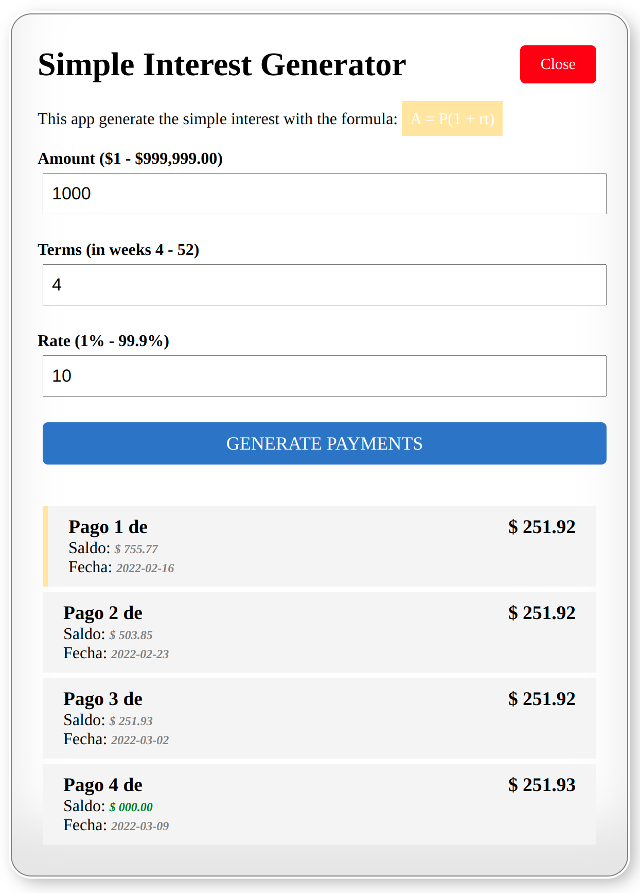

# Simple interest Generator

This demo application generate a list of payments by simple interest with the formula `A = P(1 + rt).`
The general application consist on:

- Registration server Eureka.
- Spring boot application for payments generator.
- Angular application to consume the service.



## Using Docker

We are going to run the simple interest generator app using three docker containers, one for Eureka Server, other for the microservice and last one for the angular application.

### Build the images.

1. Build using `mvn package`.
   
   This will create the jar: `target/microservice-0.0.1-SNAPSHOT.jar`


2. Build the container images:

    For `Registration` and `Payment service`
    ```sh
    docker build -t hizmarck-microservice/services:latest -f src/main/docker/services/Dockerfile .
    ```
   For `angular app`
   ```sh
   docker build -t hizmarck-microservice/angular:latest -f src/main/docker/angular/Dockerfile . 
   ``` 
   
### Running the application

To run the application we'll use the first image to run Eureka and the payment service, the second image to the angular app.

1. Create a network to share with the containers:

    ```sh
    docker network create hizmarck-microservice-net
    ```

2. Run `Eureka`:
    ```sh
    docker run --name hizmarck-registration --hostname registration --network hizmarck-microservice-net -p 1111:1111 hizmarck-microservice/services:latest java -jar app.jar
    ```
   As soon as the application starts, it displays the `IP Address`. 

3. Run the `payment microservice` include the `IP Address` from the registration server:
    ```sh
    docker run --name hizmarck-payments --hostname payments --network hizmarck-microservice-net -p 2222:2222 hizmarck-microservice/services:latest java -jar app.jar payments  --registration.server.hostname=<reg server ip addr>
    ```

4. Run the `angular app`:

    ```sh
    docker run --network hizmarck-microservice-net -p 4200:80 hizmarck-microservice/angular:latest
    ```

5. Go to the http://localhost:1111 for the registration server, http://localhost:2222 for the payment service and http://localhost:4200 for the angular app. 

